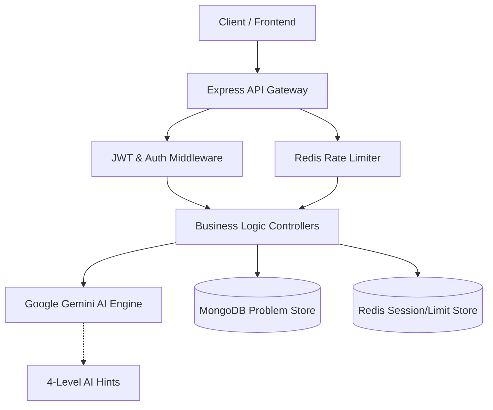

# AI-Tutored-Coding-Platform 🚀


A high-performance backend for a competitive programming platform that redefines the learning experience through **Interactive AI Tutoring**. Built with **Node.js**, **Express**, and **MongoDB**, this platform bridges the gap between static problem-solving and personalized guidance.

---

## 🏗️ Project Architecture



---

## 🔥 Unique Value Proposition: The AI Tutor

Unlike traditional platforms like LeetCode that provide static, one-size-fits-all hints, this platform features a **4-Level AI-Powered Hint System** integrated with **Google Gemini AI**. 

Our AI tutor is designed to **foster problem-solving skills** rather than just providing solutions. It follows a pedagogical approach by providing granular, structured assistance:

1.  **Level 1: Conceptual Hint** — Clarifies the problem statement and suggests a high-level approach.
2.  **Level 2: Logic Breakdown** — Explains the underlying algorithm and mathematical principles.
3.  **Level 3: Partial Code Snippet** — Provides a starting point or a tricky section of code to unblock the user.
4.  **Level 4: Comprehensive Explanation** — For deep learning, this provides the full logic and code with a detailed walkthrough.

---

## 🛡️ Security & Performance Architecture

The system is built with a "Security-First" mindset, ensuring reliability for both users and developers.

-   **Redis-Powered Rate Limiting**: To prevent API abuse and protect our AI infrastructure (Gemini API), we've implemented a robust rate-limiting layer using **Redis**. This ensures high availability and protects against brute-force attacks on sensitive endpoints.
-   **JWT Authentication**: Secure user sessions and data integrity are maintained through **JSON Web Tokens (JWT)** and **Bcrypt** password hashing.
-   **Granular Anti-Cheat Checks**: The AI logic is constrained to ensure hints are only unlocked sequentially, maintaining the integrity of the problem-solving journey.

---

## 🛠️ Tech Stack Rationale

Our choice of technologies was driven by the need for **low latency**, **scalability**, and **reasoning capabilities**.

| Technology | Why it was chosen |
| :--- | :--- |
| **Node.js & Express** | Chosen for its non-blocking I/O, which is critical for handling concurrent asynchronous requests to the AI engine. |
| **MongoDB (Mongoose)** | Provides the flexible schema required to handle diverse coding problems and complex submission histories. |
| **Redis** | Essential for ultra-fast, in-memory rate limiting and caching, ensuring the security layer doesn't bottleneck performance. |
| **Google Gemini AI** | Leveraged for its superior reasoning and pedagogical capabilities in tutoring complex technical concepts. |

---

## 🔬 Architectural Deep Dive

### Why the "Service-Controller" Pattern?
The project follows a modular architecture where the **Controllers** handle the request/response cycle, while the **Business Logic** (like AI hint generation) is isolated. This ensures that the platform remains **maintainable** and **testable** as we add more complex features.

### The Security Layer: Redis vs. Standard Middlewares
While standard Express rate-limiters work for simple apps, we chose **Redis** for its **distributed nature**. This ensures that even if we scale to multiple instances, the rate limits for expensive AI calls remain consistent and synchronized across the entire cluster.

---

## 🚀 Getting Started

### Prerequisites
- [Node.js](https://nodejs.org/) (v16+)
- [MongoDB Atlas](https://www.mongodb.com/cloud/atlas) or Local MongoDB
- [Redis](https://redis.io/)
- [Gemini AI API Key](https://aistudio.google.com/app/apikey)

### Installation & Setup
1. **Clone & Install**:
   ```bash
   git clone https://github.com/laksh0507/AI-Tutored-Coding-Platform.git
   cd AI-Tutored-Coding-Platform
   npm install
   ```
2. **Environment Configuration**:
   Create a `.env` file in the root:
   ```env
   PORT=5000
   MONGO_URI=your_mongodb_uri
   REDIS_URL=your_redis_url
   JWT_SECRET=your_secret_key
   GEMINI_API_KEY=your_api_key
   ```
3. **Execution**:
   ```bash
   npm run dev
   ```

---

**Developed with ❤️ by [LAKSHMISHA R A](https://github.com/laksh0507)**
